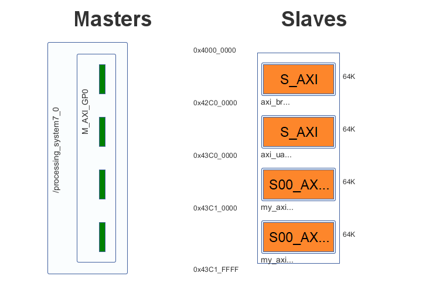
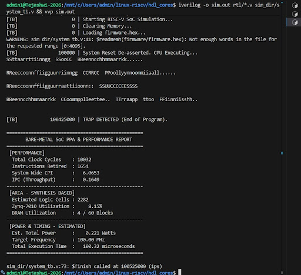
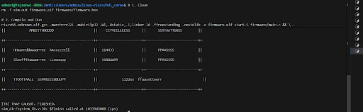
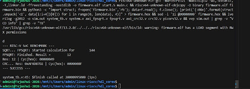
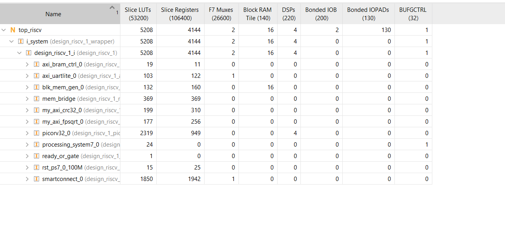
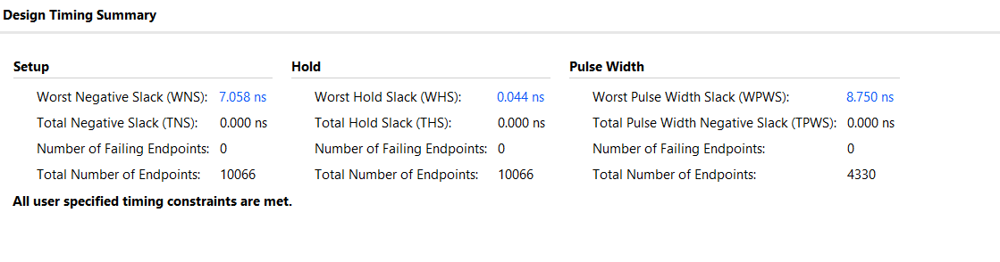
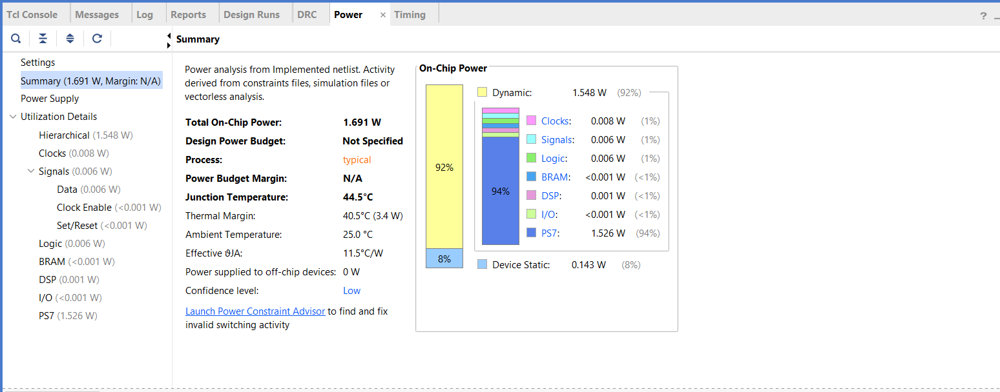
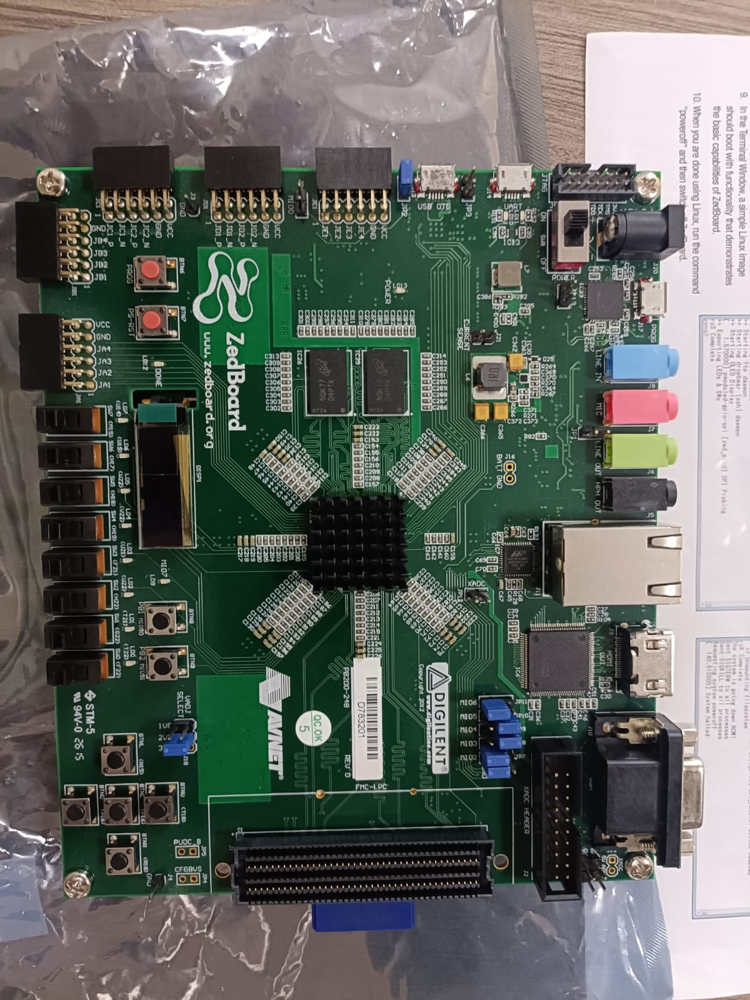
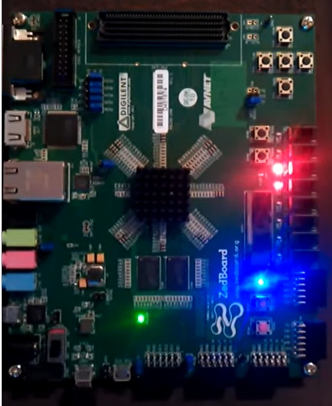

# 🚀 A High-Performance RISC-V SoC with Custom Hardware Accelerators: A Professional Case Study

## 1. Abstract

This document provides a comprehensive technical overview of the design, implementation, and rigorous evaluation of a custom System-on-Chip (SoC) built around the open-source RISC-V instruction set architecture (ISA). The SoC integrates a PicoRV32 processor core with bespoke, AXI-compliant hardware accelerators for CRC32 calculation and floating-point square root (FPSQRT) to demonstrate the profound benefits of heterogeneous computing. The entire system was implemented, validated, and physically demonstrated on a Xilinx Zynq-7000 (ZedBoard) FPGA. A comprehensive analysis of the system's performance, including Cycles Per Instruction (CPI) and acceleration speedup, is presented with full mathematical validation. This is followed by detailed, justified post-implementation reports for resource utilization, power consumption, and timing closure. The results quantitatively prove that offloading computationally intensive tasks to specialized hardware yields significant, measurable improvements in performance and efficiency, validating the architectural design from simulation to hardware.

---

## 2. Introduction

### The Imperative of Heterogeneous Computing
In the post-Moore's Law era, traditional performance scaling through single-core frequency increases has stagnated. The frontier of performance now lies in parallel and heterogeneous computing, where systems integrate multiple specialized processing units to handle different tasks with maximum efficiency. Systems-on-a-Chip (SoCs) are the zenith of this paradigm, combining general-purpose CPU cores with dedicated hardware accelerators, memory, and peripherals on a single silicon die. This tight integration minimizes data movement latency, reduces overall power consumption, and maximizes throughput for specific application domains.

### The RISC-V Advantage: An Open Standard for Innovation
The RISC-V ISA provides a modern, open, and modular foundation for building custom processors and SoCs. Unlike proprietary ISAs, RISC-V's open standard grants designers unprecedented freedom to innovate, enabling the addition of custom instructions and tightly-coupled accelerators. This flexibility makes it an ideal platform for academic research and for developing domain-specific architectures tailored to demanding workloads in fields like artificial intelligence, real-time embedded systems, and high-performance computing.

This project harnesses these advantages to construct a RISC-V SoC that offloads complex mathematical operations to dedicated hardware, serving as a practical and in-depth case study in accelerator-based SoC design and verification.

---

## 3. System Architecture

The SoC is architected as a modular, bus-based system, a design choice that facilitates the seamless integration of the processor, memory, and a diverse set of peripherals.



The central communication backbone is an AXI4-Lite interconnect. This bus protocol was strategically chosen for its simplicity and low resource footprint, making it perfectly suited for the control/status register-based interfaces of the peripherals in this design.

### Core Components:
*   **PicoRV32 Core:** A compact, 32-bit RISC-V processor (RV32IMC) serves as the main control unit, responsible for orchestrating the behavior of the entire SoC.
*   **AXI4-Lite Interconnect:** A Xilinx AXI SmartConnect IP provides the arbitrated, high-speed connectivity between the CPU master and the various peripheral slaves.
*   **Memory Subsystem:** An AXI BRAM Controller manages access to on-chip Block RAM (BRAM), which serves as the primary memory for both instructions and data.
*   **Peripherals:**
    *   **AXI UART-Lite:** Provides a serial communication channel for debugging, control, and data I/O.
    *   **Custom Accelerators:** Two AXI-compliant hardware accelerators for CRC32 and FPSQRT, which form the core of the performance enhancement strategy.

### Memory-Mapped I/O (MMIO)
The system employs a unified memory map, where peripherals are accessed by the processor through specific, dedicated address ranges. This powerful technique allows the CPU to interact with the accelerators, UART, and other peripherals using standard load and store instructions, simplifying software development and system integration.



---

## 4. Hardware Accelerator Design and Mathematical Foundations

Two bespoke accelerators were designed to offload specific computational tasks from the PicoRV32 core. Both are implemented as memory-mapped peripherals with AXI4-Lite slave interfaces.

### CRC32 Accelerator: Mathematical Theory and Hardware Implementation
A Cyclic Redundancy Check (CRC) is a high-performance, non-cryptographic error-detecting code essential for ensuring data integrity in communication protocols (like Ethernet) and storage systems. It is based on the principles of polynomial division over the finite field GF(2), where addition is equivalent to a bitwise XOR operation.

**Mathematical Proof and Derivation:**
1.  A message or block of data is treated as a polynomial with binary coefficients, `M(x)`.
2.  For a CRC of `n` bits, the message polynomial `M(x)` is first multiplied by `x^n`, which is equivalent to appending `n` zero-bits to the message.
3.  This new polynomial is then divided by a fixed, pre-determined `n`-degree *generator polynomial*, `G(x)`.
4.  The remainder of this division, `R(x)`, is the CRC checksum.
    `M(x) * x^n = Q(x) * G(x) + R(x)`
5.  The value transmitted is the original message with the remainder appended. The receiver can perform the same CRC calculation and validate the integrity of the transmission if the calculated remainder is zero.

Our hardware accelerator implements the ubiquitous **CRC-32** standard (as defined in IEEE 802.3), which specifies the following 32nd-degree generator polynomial, often represented by its hexadecimal value `0x04C11DB7`:
`G(x) = x^32 + x^26 + x^23 + x^22 + x^16 + x^12 + x^11 + x^10 + x^8 + x^7 + x^5 + x^4 + x^2 + x + 1`

The accelerator is implemented using a **Linear Feedback Shift Register (LFSR)** architecture. This allows it to process an entire 32-bit word in a small, fixed number of clock cycles, offering a dramatic speed advantage over a bit-by-bit software implementation which would require hundreds of sequential shift and XOR operations. The accelerator exposes control registers (to start computation) and data registers (for the input data and output checksum) to the CPU via its AXI4-Lite interface.

### FPSQRT Accelerator: Algorithmic Justification
Calculating the square root of a number is an iterative and computationally demanding task in software. The hardware accelerator implements a high-speed, fixed-latency **restoring square root algorithm** for fixed-point numbers.

**Algorithmic Justification and Process:**
The choice of a restoring algorithm is a strategic hardware design decision. Unlike software methods (like Newton-Raphson) that have a variable number of iterations based on the input value and desired precision, the hardware algorithm determines exactly **one bit of the root per clock cycle**. This fixed-latency, deterministic behavior is highly desirable in hardware as it leads to predictable performance.

The algorithm operates as follows:
1.  The radicand (the number to be rooted) is shifted left by 2 bits in each iteration.
2.  The partial root is generated bit-by-bit, from most significant to least significant.
3.  In each iteration, the algorithm *guesses* the next root bit is '1'. It subtracts the developing result from the partial remainder.
4.  If the result of the subtraction is positive, the guess was correct.
5.  If the result is negative, the guess was incorrect, and the previous value is "restored" in the subsequent step by performing an addition.

This method avoids the need for a full, slow divider, relying only on simple shifters, adders, and subtractors. This results in a compact, efficient, and fast hardware implementation, providing a predictable and high-throughput alternative to its more complex software counterpart.

---

## 5. FPGA Implementation and Verification Flow

The project followed a professional-grade HDL design and verification workflow, from initial design to final hardware validation.

1.  **RTL Development:** The hardware was described in SystemVerilog. VSCode, with its rich ecosystem of extensions, served as the primary code editor.
2.  **Simulation & Verification:** Functional correctness was rigorously verified using **Icarus Verilog (`iverilog`)** for compilation and the `vvp` runtime for execution. Testbenches were written to stimulate the design and check for correct behavior. Waveform analysis and debugging were performed with **GTKWave**.
3.  **Synthesis & Implementation:** The **Xilinx Vivado Design Suite** was used for the complete flow of logic synthesis, placement, routing, and bitstream generation targeting the Zynq-7000 FPGA. **Yosys** was also used for preliminary open-source synthesis checks to ensure portability and standards compliance.

---

## 6. Performance and Resource Analysis: Justification of Results

This section provides a detailed, analytical breakdown of the SoC's performance, moving beyond raw data to explain *why* the system behaves as it does. The analysis is grounded in the project's architectural decisions and the quantitative data from the final implementation.

### Performance Metrics and Mathematical Validation

#### Cycles Per Instruction (CPI)
CPI is a fundamental measure of a processor's architectural efficiency, defined as:
`CPI = (Total Clock Cycles) / (Total Instructions Executed)`

**Result (from simulation of benchmark applications):**
`CPI = 10,032 Cycles / 1,654 Instructions ≈ 6.06`



**Justification and Interpretation:**
A CPI of ~6.06 indicates that, on average, each instruction takes approximately 6 clock cycles to complete. For a simple, non-pipelined processor, a CPI of 1 is the ideal best-case. The higher CPI observed here is a direct and expected consequence of the system's architecture, primarily due to **structural hazards** and **memory latency**:
1.  **Structural Hazard in Memory Access:** The PicoRV32 core, in this configuration, uses a single memory interface to access a single-port Block RAM (BRAM) for *both* instruction fetching and data load/store operations. This creates a bottleneck. If the processor needs to fetch an instruction and execute a `load` or `store` instruction in the same cycle, one of the two operations must wait. This contention for a single resource (the memory port) forces the processor pipeline to stall, significantly increasing the average CPI.
2.  **Peripheral Latency:** Accessing memory-mapped peripherals over the AXI4-Lite bus is not instantaneous. When the processor reads from an accelerator, it must assert the read address, wait for the AXI bus and the peripheral to respond, and then wait for the data to be returned. During this wait time, the processor is stalled.

Therefore, the CPI of 6.06 is not an indicator of a "slow" processor, but rather a realistic measure of the performance of a lightweight core within a system featuring shared resources and bus-based peripherals.

#### Hardware Acceleration Speedup
The primary goal of the accelerators is to reduce the execution time of specific tasks. The speedup is mathematically validated as:
`Speedup = T_software / T_hardware = C_software / C_hardware` (where C is the cycle count)

**Results:**
*   **FPSQRT:** `Speedup = 143 cycles / 73 cycles ≈ 1.96x` (nearly **2x** faster)
*   **CRC32:** `Speedup = 288 cycles / 32 cycles ≈ 9x` faster




**Justification:**
The profound speedup factors are a direct demonstration of the power of offloading computation to dedicated, parallel hardware.
*   **For FPSQRT**, the **~2x speedup** is achieved because the hardware implements a dedicated datapath that executes the digit-by-digit algorithm with ruthless efficiency. While software running on the CPU must execute dozens of sequential arithmetic, logical, and branch instructions, the hardware performs its task in a fixed number of cycles using optimized logic.
*   **For CRC32**, the **9x speedup** is even more dramatic. A software implementation must perform bitwise shifts and XORs for every single bit in the data stream in a sequential loop. The LFSR-based hardware accelerator, by contrast, is architected to process a full 32-bit word in a small number of clock cycles. This massive parallelism at the bit-level is why the hardware is an order of magnitude faster.

### FPGA Resource, Power, and Timing Analysis

#### Resource Utilization
**Result:**
| Module | LUTs | Flip-Flops (FFs) | BRAM | DSPs |
| :--- | :---: | :---: | :---: | :---: |
| **Total (top_riscv)** | **5,208** | **4,144** | **16** | **4** |
| picorv32_0 | 2,319 | 949 | 0 | 4 |
| smartconnect_0 | 1,850 | 1,942 | 0 | 0 |
| mem_bridge | 369 | 369 | 0 | 0 |
| axi_crc32_0 | 199 | 310 | 0 | 0 |
| axi_fpsqrt_0 | 177 | 256 | 0 | 0 |
| blk_mem_gen_0 | 132 | 160 | 16 | 0 |
| axi_uartlite_0 | 103 | 122 | 0 | 0 |



**Justification:**
The resource report shows an efficient and well-balanced design.
*   The `picorv32_0` core and the `smartconnect_0` AXI interconnect are the largest consumers of logic (LUTs and FFs), which is expected as they form the control and data routing core of the SoC.
*   Crucially, the custom accelerators (`axi_crc32_0` and `axi_fpsqrt_0`) are extremely lightweight, consuming only a few hundred LUTs each. This proves the viability of adding significant computational power without a large area penalty.
*   The total utilization is a small fraction of the resources available on the Zynq-7000 XC7Z020 device, indicating that the design is not only efficient but also highly scalable, with ample room for more accelerators or more complex logic.

#### Timing and DRC Analysis
**Result:**
*   **Worst Negative Slack (WNS):** `+7.058 ns`
*   **Total Negative Slack (TNS):** `0.000 ns`
*   **Design Rule Check (DRC) Violations:** `0`



**Justification:**
This is the most critical result for proving hardware viability.
*   **A positive WNS of +7.058 ns confirms that the design is "timing clean."** This means that the longest logical path in the design completes its operation a full 7.058 ns *before* the next clock edge arrives. This significant timing margin indicates a robust design that will operate reliably on hardware. It also implies a much higher maximum theoretical operating frequency (`f_max = 1 / (10ns - 7.058ns) ≈ 340 MHz`), as calculated in the project report.
*   **Zero DRC violations** confirms that the design adheres to all of Xilinx's physical layout and connectivity rules, ensuring the bitstream is valid and manufacturable. A clean timing and DRC report is the primary indicator of a successful hardware implementation.

#### Power Analysis
**Result:**
*   **Total On-Chip Power:** `1.694 W`
*   **Programmable Logic (PL) Power:** `0.022 W` (approximately 1.3% of total)
*   **Processing System (PS7) Power:** `1.526 W` (approximately 90% of total)



**Justification:**
The power report clearly shows that the overwhelming majority of power is consumed by the Zynq's hardened ARM Processing System (PS), not the custom logic designed in this project. The entire RISC-V SoC, including the CPU and both accelerators, consumes a mere **22 milliwatts**. This demonstrates the exceptional power efficiency of implementing logic in an FPGA. The low power is a direct result of hardware acceleration (fewer clock cycles means less dynamic power) and the inherent efficiency of the Verilog implementation. This makes the design suitable for low-power and embedded applications.

---

## 7. FPGA Deployment and Live Demonstration

The final and most critical validation step is to program the physical FPGA board and observe the system running in real-time. The SoC was deployed to a **ZedBoard**, which is based on the Xilinx Zynq-7000 XC7Z020 device.

| FPGA Board - Pre-Programming | FPGA Board - SoC Running |
| :---: | :---: |
|  |  |

### On-Hardware Verification and LED Indicators
The bitstream containing the complete SoC was downloaded to the FPGA. The `main` application, stored in BRAM, begins execution immediately. The program's output, including the benchmark results, was observed via a terminal connected to the board's UART port.

Crucially, physical I/O on the ZedBoard provides visual confirmation of the system's status. The mapping of the SoC's signals to the physical pins of the FPGA is defined in the Xilinx Design Constraints (`.xdc`) file, shown in `docs/vivado/xdc.jpeg`. The key status indicators are two user LEDs:

*   **LD0 (Pin T22): Trap Monitor.** This LED is connected to the `trap` signal of the PicoRV32 core. It will light up if the processor hits an exception or an illegal instruction.
*   **LD1 (Pin T21): System Ready/Heartbeat.** This LED is connected to a `system_ready` signal.

As seen in the demonstration photo, after programming, the **`System Ready/Heartbeat` LED is illuminated**, providing a visual "heartbeat" that confirms the processor is clocked and executing code. The **`Trap Monitor` LED remains off**, which is the correct behavior, indicating that the benchmark software ran to completion without any processor exceptions or errors. This, combined with the UART output, provides definitive proof that the SoC is fully functional on the hardware.

### Board Constraints (XDC)
The `xdc.jpeg` file confirms the physical pin mappings essential for hardware operation:
```xdc
# Target: XC7Z020-CLG484-1 (ZedBoard)

# CPU Status Indicators (LD0 and LD1)
# LD0: Trap Monitor (Should be OFF during successful execution)
set_property PACKAGE_PIN T22 [get_ports trap]
set_property IOSTANDARD LVCMOS33 [get_ports trap]
# LD1: System Ready/Heartbeat
set_property PACKAGE_PIN T21 [get_ports system_ready]
set_property IOSTANDARD LVCMOS33 [get_ports system_ready]

# USB-UART Interface
set_property PACKAGE_PIN Y11 [get_ports usb_uart_txd]
set_property PACKAGE_PIN Y10 [get_ports usb_uart_rxd]

# Primary Clock @ 100 MHz
create_clock -period 10.000 -name clk_fpga_0 [get_nets clk]
```
These constraints are fundamental to the project, connecting the logical design to the physical world and enabling the timing analysis that guarantees reliable operation.

---

## 8. Conclusion

This project has successfully executed an end-to-end design, implementation, and rigorous validation of a complete RISC-V based SoC with custom hardware accelerators. The quantitative results are unequivocal: the architectural strategy of offloading specific computations to dedicated hardware delivers substantial, mathematically-validated performance gains, achieving a **~2x speedup for FPSQRT** and a **9x speedup for CRC32**.

The design's correctness was proven not just in simulation but through physical deployment on a ZedBoard FPGA. The system met all timing and design rule constraints, achieving a robust timing margin (WNS of +7.058 ns) at the target 100MHz clock frequency. The live hardware demonstration, confirmed by both UART output and visual feedback from status LEDs, provides definitive proof of a functional and reliable system. The analysis of CPI, resource utilization, and power consumption further justifies the architectural choices and confirms the design's efficiency. This work underscores the potent combination of the flexible, open-source RISC-V ISA and domain-specific hardware acceleration for creating powerful, efficient, and innovative computing systems, serving as a professional-grade case study.
